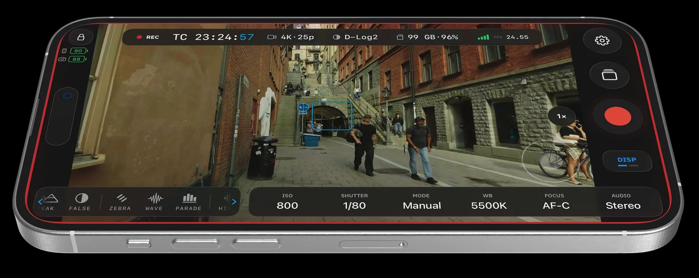
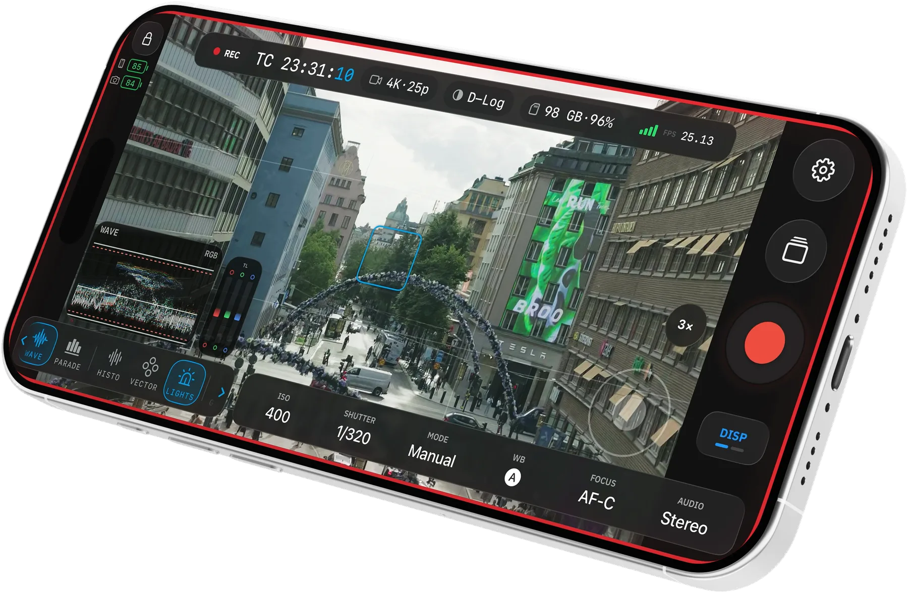
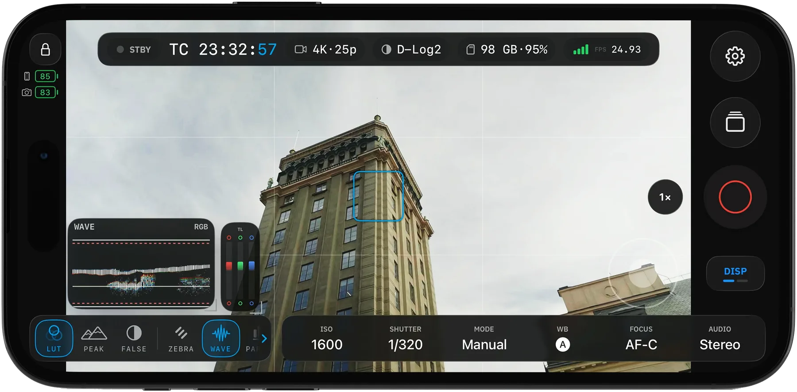
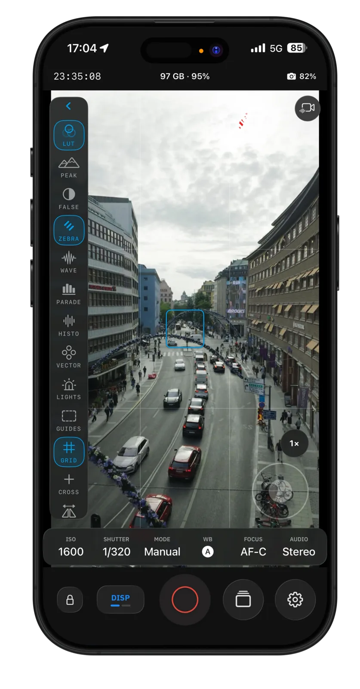

# OpenPocketCine

[](https://github.com/erik-sutton95/OpenPocketCine/actions/workflows/ci.yml)
[](LICENSE)

<p align="center">
  <strong>The open field monitor for DJI Osmo Pocket.</strong><br>
  Pro monitoring scopes, playback, camera control, and Camera-to-Cloud export with LUT
  baking. Free and open source.
</p>

<p align="center">
  <a href="https://openpocketcine.app/"><strong>Visit openpocketcine.app</strong></a>
  &nbsp;·&nbsp;
  <a href="https://github.com/erik-sutton95/OpenPocketCine/discussions">Explore the roadmap</a>
</p>

## Made for the shot

OpenPocketCine turns an iPhone, iPad, or Android phone into a production monitor and remote for
**DJI Osmo Pocket** cameras, with current development and testing centered on the **Osmo Pocket 4 /
4 Pro** (HEVC live view) and **Osmo Nano** (AVC live view). iOS is the daily driver; Android lives
in this repository and is not on Google Play yet.

- **Read the image like a colorist.** Waveform, RGB parade, histogram, and vectorscope run live
  beside the image you are judging.
- **Catch exposure and focus before the take.** False color, zebras, Traffic Lights, and
  industry-standard focus peaking work directly on the monitor feed.
- **Frame once for every delivery.** Stack grids, guides, and crosshairs without losing sight of
  the shot.
- **Keep the camera in the rig.** Saved-camera profiles, Bluetooth pairing, and a join to the
  camera's own Wi-Fi — then ISO, EV, zoom, gimbal, and record from the phone.
- **Review before striking the set.** Browse clips, scrub playback, check scopes, and preview the
  selected look on-device.
- **Ship it with the look baked in.** Apply built-in or custom `.cube` LUTs, then send through
  platform-native sharing or directly to Frame.io.

Verify record start/stop on the camera body until you trust the link. Reverse-engineered control
can be incomplete.

## See it in action

<table>
  <tr>
    <td align="center">
      
    </td>
    <td align="center">
      
    </td>
  </tr>
  <tr>
    <td align="center">
      
    </td>
    <td align="center">
      
    </td>
  </tr>
</table>

## Available today

- Resilient Bluetooth pairing, camera Wi-Fi join, saved-camera profiles, and reconnect
- Live-view monitoring, timecode, battery, storage, and camera status readouts
- Record control plus ISO, EV, zoom, gimbal, and related camera writes
- Professional scopes, exposure and focus assists, framing tools, and customizable monitor layouts
- On-device clip browsing, playback review, LUT preview, and optional Frame.io delivery
- Native iPhone and iPad layouts

The native Android implementation lives in this repository. It is not available through Google Play
yet. Pocket 4 / 4 Pro and Nano are the hardware targets today; wider Osmo coverage continues with
real-world testing.

## Roadmap shaped in the open

The roadmap lives in [GitHub Discussions](https://github.com/erik-sutton95/OpenPocketCine/discussions),
where proposed features can have their own thread. Browse the
[Ideas category](https://github.com/erik-sutton95/OpenPocketCine/discussions/categories/ideas-feature-requests)
to vote, add production context, or propose what OpenPocketCine should tackle next. Roadmap
discussions describe direction, not promised dates or release commitments. Engineering-phase detail
lives in [`docs/ROADMAP.md`](docs/ROADMAP.md).

## Free. Open source. Yours

No subscriptions, no paywalls, no advertising, and no telemetry. OpenPocketCine is Apache-2.0
licensed and built in public with the latest frontier models — Grok, Codex, and Claude — so
filmmakers and developers can inspect, improve, and adapt the tool they rely on.

## Architecture

Production targets a shared Swift business/protocol core with native platform shells:

| Layer | Path | Purpose |
| --- | --- | --- |
| **Shared core** | `Sources/OpenPocketViewCore/` | DUML framing, datalink, BLE adverts, commands, status |
| **iOS app** | `ios/OpenPocketCine/` | SwiftUI shell, CoreBluetooth, Hotspot Configuration, VideoToolbox |
| **Android app** | `Apps/Android/app/` | Jetpack Compose phone shell and Android platform adapters |
| **Android facade** | `Sources/OpenPocketCineAndroidFacade/` | Swift session and JNI boundary for Android |
| **Tests** | `Tests/OpenPocketViewCoreTests/` | Swift package tests — framing, transport, discovery, layout |

The shared Swift core owns protocol logic and stays portable (no SwiftUI, UIKit, or Android
dependencies). Platform shells own sockets, permissions, lifecycle, rendering, and UI.

See [`docs/ARCHITECTURE.md`](docs/ARCHITECTURE.md).

### Built in the open

OpenPocketCine is deliberately, transparently built in public with the latest frontier models
such as Grok, Codex, and Claude. Engineering guidelines live in [`AGENTS.md`](AGENTS.md).

OpenPocketCine went through an extended private R&D phase before publication; the public
repository starts from a clean slate with a squashed initial commit rather than carrying the
experimental history along.

## Credits

### Osmosis

I learned the BLE pairing and camera Wi-Fi connection path with the help of
[Osmosis](https://github.com/KonradIT/osmosis) by Konrad Iturbe — a generous open Android client
for Osmo cameras. I'm grateful. OpenPocketCine is its own implementation; Osmosis was inspiration
for that connection story, not a source I copied.

Please go look at [Osmosis](https://github.com/KonradIT/osmosis) too. If you care about talking to
Osmo cameras, Konrad's work is worth your time.

### OpenZCine

The field-monitor architecture follows [OpenZCine](https://github.com/erik-sutton95/OpenZCine).

## No vendor SDK

This project is not affiliated with DJI. No DJI SDK or proprietary documentation is included in,
distributed with, or required by this project.

## Development

Tooling is managed through [`just`](https://github.com/casey/just):

```bash
just setup         # install meta-check tools (macOS / Homebrew)
just               # list all recipes
just check         # run repository quality checks
just format        # format Swift sources
just test          # run Swift package tests
just native-check  # run Swift tests and build the native iOS app
just android-build # build the Android app and staged Swift runtime
just android-check # build, test, and lint Android
```

The iOS Xcode project is generated:

```bash
cd ios && xcodegen generate && open OpenPocketCine.xcodeproj
```

The Simulator has no Bluetooth or camera Wi-Fi. Pairing and live view need a physical iPhone.

## Contributing

Contributions are welcome!

- See [`CONTRIBUTING.md`](CONTRIBUTING.md) for development workflow, code standards, and how to report bugs vs. request features.
- Bugs: [GitHub's bug-report form](https://github.com/erik-sutton95/OpenPocketCine/issues/new?template=bug_report.yml). Never put camera Wi-Fi passwords or captures in an issue.
- We use **GitHub Discussions** (Ideas category) for feature requests.
- Standardized labels help triage work — see [`.github/labels.yml`](.github/labels.yml).

Please also read our [`CODE_OF_CONDUCT.md`](CODE_OF_CONDUCT.md). For security issues, see [`SECURITY.md`](SECURITY.md).

## License

[Apache 2.0](LICENSE). Third-party licenses are listed in
[`THIRD-PARTY-NOTICES.md`](THIRD-PARTY-NOTICES.md). The app's privacy policy lives at
[openpocketcine.app/privacy](https://openpocketcine.app/privacy/).

"DJI", "Osmo", "Osmo Pocket", and "Mimo" are trademarks of SZ DJI Technology Co., Ltd., used here
for identification only.
